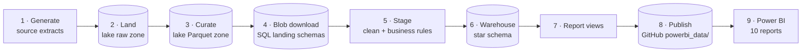

# Utility Power BI Migration

An end-to-end demo of migrating a utility's Excel/SharePoint reporting to Power BI. It is built to mirror the data environment of a New Jersey combined electric and gas utility:

> **Current state:** SAP and operational systems → **AWS data lake** → blob download → **SQL Server** → ~10 **Excel** reports → stored in **SharePoint**
>
> **This demo:** the same flow, rebuilt so every stage can be run and inspected locally for free. **GitHub replaces SharePoint** as the store for the data Power BI reads, and **Power BI replaces the Excel reports**.

The README walks through the pipeline **one stage at a time, in the order data flows**. Each stage says what it does, why it exists, how to run it, and what it produced.

> **All data is synthetic.** Customers, accounts, addresses and amounts are generated. Town names, ZIP codes and tariff codes are public reference data used for realism. This project is not affiliated with, or built from data of, any utility.

---

## The pipeline at a glance



| # | Stage | Tool | Replaces / mirrors | Output |
|---|---|---|---|---|
| 1 | Generate source extracts | `generator/generate.py` | SAP IS-U/FI-CA, SAP PM, AMI, OMS, CRM | 18 tables, 49.5M rows, csv.gz |
| 2 | Land in the lake (raw zone) | `lake/upload_raw.py` → S3-compatible storage | Systems dropping files into AWS S3 | `s3://utility-lake/raw/` · 872 MB |
| 3 | Curate (raw → Parquet) | `lake/build_curated.py` (DuckDB) | Athena CTAS / Glue | `s3://utility-lake/curated/` · 534 MB |
| 4 | Blob download → SQL | `lake/download_to_sql.py` | The existing lake → SQL transfer | 18 landing tables in `UtilityDW` |
| 5 | Stage | `sql/01_stg.sql` | Cleanup logic hidden in Excel today | 14 `stg` views, 11 DQ fixes |
| 6 | Warehouse | `sql/02–05_dw_*.sql` | One shared definition of every measure | 5 dimensions + 11 facts |
| 7 | Report views | `sql/06_rpt.sql` | The data behind each Excel workbook | 21 `rpt` views |
| 8 | Publish | `sql/export_powerbi_data.py` → GitHub | SharePoint | 21 Parquet files · 48 MB |
| 9 | Report | Power BI Desktop | ~10 Excel workbooks | 10 report pages + Customer 360 |

Supporting docs: [architecture](docs/architecture.md) · [report catalog](docs/reports.md) · [source systems & data dictionary](docs/source_systems.md)

---

## Stage 1 · Generate the source-system extracts

**What:** `generator/generate.py` simulates six source systems for 500,000 premises over **Oct 2024 – Sep 2026**. It writes them the way they'd arrive from each system: SAP tables keep SAP column names, `YYYYMMDD` integer dates and `'X'` flags.

| Source system | Tables | Rows |
|---|---|---:|
| SAP IS-U / FI-CA (customer, billing, payments) | `BUT000`, `ADRC`, `EVBS`, `FKKVKP`, `EANL`, `EVER`, `EQUI`, `ERCH`, `DFKKZP`, `ZINSTPLAN`, `ZSRVORD` | 28.5M |
| SAP Plant Maintenance | `AUFK` (work orders) | 275K |
| AMI head-end | `daily_reads` (25K-meter sample) | 18.25M |
| Outage Management System | `outage_events` | 15K |
| Contact center (CRM) | `interactions` | 2.5M |
| Weather feed + reference | `daily_weather`, `towns`, `rate_schedules` | <1K |

**Why it's realistic:** usage follows the weather (summer AC peaks, winter gas peaks); a supply-rate increase on 2025-06-01 drives a spike in high-bill complaints; storm days line up across outages, emergency work orders and call volumes; hidden customer payment behaviours drive arrears; and NJ's winter shut-off moratorium shapes when disconnects happen. **Data-quality problems are injected on purpose** (bad ZIPs, messy city names, duplicate payments...) so later stages have real cleanup to do. See [docs/source_systems.md](docs/source_systems.md).

```bash
python generator/generate.py --scale large     # ~4.5 min  (small: ~10 s, medium: ~1 min)
```

## Stage 2 · Land in the data lake (raw zone)

**What:** the extracts are uploaded unchanged to the lake bucket `utility-lake` under `raw/<system>/<table>/`. The big tables keep monthly `year_month=YYYY-MM` folders.

**The lake runs locally and free.** [Versity S3 Gateway](https://github.com/versity/versitygw) (Apache-2.0) runs in Docker and speaks the S3 API, so the upload uses plain `boto3`, exactly as it would against AWS. The bucket is also an ordinary folder (`C:\Data\utility-powerbi\lake\utility-lake\`), and a web UI runs at http://localhost:7071.

```bash
python lake/init_env.py                            # one-time: local S3 keys -> lake/.env (gitignored)
docker compose -f lake/docker-compose.yml up -d    # S3 API :7070, web UI :7071
python lake/upload_raw.py                          # 134 files, 872 MB in ~50 s (skips unchanged files)
```

## Stage 3 · Curate: raw CSV → typed Parquet

**What:** DuckDB reads every raw file straight from the lake, types each column, and writes **zstd-compressed Parquet** to `curated/`. This is the job Athena CTAS or Glue does in AWS. Each table's row count is checked against the raw manifest.

**Design choice:** the lake only fixes *format and types*. Business rules and data-quality fixes are left for the SQL staging layer, so every correction is visible and auditable there.

```bash
python lake/build_curated.py        # ~6 min
```

### Curated Parquet files

```
s3://utility-lake/curated/
├── _manifest.json                                    row counts + source manifest
├── sap_isu/ERCH/year_month=2024-10/data_0.parquet    ← monthly partitions (24 per big table)
│   ...
└── sap_isu/BUT000/data.parquet                       ← single file for dimension-sized tables
```

Queries that filter on a month read only that month's folder, the same partition pruning Athena does.

| Table | Contents | Rows | Files | Partitioned | Raw csv.gz | Parquet |
|---|---|---:|---:|:---:|---:|---:|
| `sap_isu/ERCH` | Billing documents | 12,061,301 | 24 | by month | 429.2 MB | 277.1 MB |
| `sap_isu/DFKKZP` | Payments | 11,521,003 | 24 | by month | 168.2 MB | 79.9 MB |
| `ami/daily_reads` | AMI daily meter reads | 18,250,000 | 24 | by month | 165.2 MB | 111.7 MB |
| `crm/interactions` | Contact center interactions | 2,500,000 | 24 | by month | 46.6 MB | 29.1 MB |
| `sap_pm/AUFK` | Work orders | 275,000 | 24 | by month | 8.9 MB | 5.6 MB |
| `sap_isu/EVER` | Contracts | 913,174 | 1 | – | 10.5 MB | 5.1 MB |
| `sap_isu/EANL` | Installations | 829,621 | 1 | – | 5.1 MB | 2.4 MB |
| `sap_isu/EQUI` | Meters | 829,621 | 1 | – | 8.3 MB | 3.9 MB |
| `sap_isu/BUT000` | Business partners (customers) | 550,178 | 1 | – | 9.7 MB | 6.2 MB |
| `sap_isu/FKKVKP` | Contract accounts | 550,178 | 1 | – | 4.4 MB | 2.2 MB |
| `sap_isu/ADRC` | Service addresses | 500,000 | 1 | – | 9.0 MB | 6.7 MB |
| `sap_isu/EVBS` | Premises | 500,000 | 1 | – | 3.3 MB | 1.7 MB |
| `sap_isu/ZSRVORD` | Service orders | 153,496 | 1 | – | 2.8 MB | 2.1 MB |
| `sap_isu/ZINSTPLAN` | Payment arrangements | 30,186 | 1 | – | 0.5 MB | 0.3 MB |
| `oms/outage_events` | Outage events | 14,954 | 1 | – | 0.3 MB | 0.3 MB |
| `weather/daily_weather` | Daily weather | 760 | 1 | – | <0.1 MB | <0.1 MB |
| `reference/towns` | Town → county/division lookup | 45 | 1 | – | <0.1 MB | <0.1 MB |
| `reference/rate_schedules` | Tariff lookup | 10 | 1 | – | <0.1 MB | <0.1 MB |
| **Total** | | **49,479,527** | **134** | | **872 MB** | **534 MB** |

### Typing rules

| Raw form | Parquet type | Example columns |
|---|---|---|
| SAP `YYYYMMDD` integer | `DATE` (`0` → NULL; `99991231` kept as open-ended 9999-12-31) | `BUDAT`, `FAEDN`, `EINZDAT`, `AUSZDAT` |
| SAP `HHMMSS` | `TIME` | `ERZEIT` |
| IDs and counts | `BIGINT` | `PARTNER`, `VKONT`, `BELNR`, `CUSTOMERS_OUT` |
| Money | `DECIMAL(14,2)` | `TOTAL_AMT`, `BETRZ`, `PLAN_COST` |
| Measures | `DOUBLE` | `KWH`, `THERMS`, `PEAK_KW`, `GEO_LAT` |
| ISO timestamps / dates | `TIMESTAMP` / `DATE` | `EVENT_START`, `CREATED_TS`, `READ_DATE` |
| Everything else | `VARCHAR`, **exactly as delivered** | ZIPs, phones, `'X'` flags, codes like `SPARTE='01'` |

To query the Parquet directly:

```python
import sys; sys.path.insert(0, "lake")
import config
con = config.duckdb_connect()
print(con.sql("""
    SELECT year_month, sum(TOTAL_AMT) AS billed
    FROM read_parquet('s3://utility-lake/curated/sap_isu/ERCH/**/*.parquet', hive_partitioning = true)
    WHERE STORNODAT IS NULL
    GROUP BY 1 ORDER BY 1
""").df())
```

## Stage 4 · Blob download into SQL Server

**What:** this mirrors the employer's "blob download from the lake into SQL". `download_to_sql.py`:

1. downloads the curated Parquet objects (skipping unchanged files)
2. converts each table to CSV with DuckDB and infers SQL Server column types and lengths
3. recreates the table in a **landing schema named after its source system** (`sap_isu`, `sap_pm`, `ami`, `oms`, `crm`, `weather`, `reference`) and `BULK INSERT`s it
4. checks the row count against the lake manifest and logs the load to **`etl.load_log`**

Tables over 1M rows use **clustered columnstore** indexes, so all 49.5M rows fit easily in SQL Server Express/LocalDB (10 GB cap).

```bash
python lake/download_to_sql.py                   # all 18 tables, ~18 min
python lake/download_to_sql.py sap_isu/ERCH      # reload a single table
```

Database: `UtilityDW` on `(localdb)\MSSQLLocalDB`, files in `C:\Data\utility-powerbi\sqldb`.

## Stage 5 · Staging: clean-up and business rules

**What:** `sql/01_stg.sql` creates 14 **views** in the `stg` schema. They rename SAP fields to business names, decode codes (`ABRVORG '03'` → `Final`), turn SAP flags into BITs, and **fix the data-quality issues**. Views store nothing, so staging is always in sync with the landing data.

| # | Source | Issue found | Fix applied | Rows affected |
|---:|---|---|---|---:|
| 1 | `sap_isu.ADRC` | ZIP lost its leading zero (`7102`) | Left-pad to 5 digits | 7,379 (1.5%) |
| 2 | `sap_isu.ADRC` | City upper-cased / trailing spaces | Canonical city from ZIP lookup | 24,892 (5.0%) |
| 3 | `sap_isu.BUT000` | Last name in all caps | Proper case | 9,739 (1.8%) |
| 4 | `sap_isu.BUT000` | Phone in 4 different formats | Normalize to 10 digits | 202,053 (36.7%) |
| 5 | `sap_isu.BUT000` | Missing email | Kept; reported as a contactability gap | 138,178 (25.1%) |
| 6 | `sap_isu.DFKKZP` | Duplicate payment rows (re-extract) | De-duplicated on `PAYMENT_ID` | 17,256 (0.15%) |
| 7 | `sap_isu.ERCH` | Reversed bills | Excluded from revenue & AR (rebill carries amount) | 35,650 (0.3%) |
| 8 | `ami.daily_reads` | Missing reads | Flagged, excluded from averages | 146,019 (0.8%) |
| 9 | `ami.daily_reads` | Spikes > 15× meter average | Flagged as outliers | 3,671 (0.02%) |
| 10 | `crm.interactions` | Contact not linked to a customer | Kept; reported as unidentified | 227,773 (9.1%) |
| 11 | `oms.outage_events` | Outage still open at as-of date | Excluded from closed-event durations | 2 |

These counts are stored in `dw.dq_summary` and feed the report's data-quality page, so problems are **surfaced, not hidden**.

## Stage 6 · Warehouse: star schema

**What:** `sql/02_dw_core.sql` through `sql/05_dw_quality.sql` build a star schema in the `dw` schema. It's rebuilt from staging on every run, and large facts are clustered columnstore.

| Table | Grain | Rows |
|---|---|---:|
| `dim_date` | Day (2014–2026) + weather, winter-moratorium flag, **major event day** flag | 4,748 |
| `dim_customer` | Customer / contract account | 550,178 |
| `dim_premise` | Premise + rate codes + meter technology | 500,000 |
| `dim_geography` | Town → county → division, with customers served | 45 |
| `dim_rate` | Tariff | 10 |
| `fact_bill` | Billing document | 12,061,301 |
| `fact_payment` | Payment (de-duplicated) | 11,503,747 |
| `fact_ami_daily` | Meter × day | 18,250,000 |
| `fact_interaction` | Contact center interaction | 2,500,000 |
| `fact_work_order` | SAP PM work order | 275,000 |
| `fact_service_order` | Service order | 153,496 |
| `fact_payment_plan` | Payment arrangement | 30,186 |
| `fact_outage` | Outage event | 14,954 |
| `fact_ar_customer` | Customer open balance at as-of date | 325,752 |
| `fact_ar_monthly` | Month-end × segment × division × aging bucket | 2,112 |
| `dq_summary` | Data-quality check | 11 |

Business logic encoded here, so every report uses the same definition:

- **AR aging at every month-end.** Each bill's balance is rebuilt from cumulative payments at every month-end, then bucketed Current / 1-30 / 31-60 / 61-90 / 91-180 days past due. Balances **more than 180 days past due are written off** to bad debt and leave receivables. Result: AR is steady at about $231M (0.7 months of billing) with 31–37% past due.
- **Reliability per IEEE 1366.** Daily SAIDI is computed and **major event days** are flagged with the 2.5-beta method, so SAIDI/SAIFI can be reported with and without storms. Excluding major events: SAIDI 81 min, SAIFI 0.78 per year.
- **Winter moratorium and medical certificates** are flagged, so the Collections report can check compliance. The data shows 31 residential disconnects completed inside the Nov 15 – Mar 15 window, which are exceptions to investigate.

```bash
python sql/build_warehouse.py          # runs 01 → 06 in order (~20 min at Large scale)
python sql/build_warehouse.py 03 06    # rebuild just AR and the report views
```

## Stage 7 · Report views

**What:** `sql/06_rpt.sql` defines 21 views, one or more per report, at exactly the grain each Power BI page needs. Most are **pre-aggregated**, so Power BI loads thousands of rows instead of millions. Only the drill-through views stay at row level.

| Report | Views |
|---|---|
| 1 Revenue & Billing | `revenue_residential_monthly`, `revenue_commercial_monthly`, `dim_period` (shared key) |
| 2 AR Aging | `ar_aging_monthly`, `ar_top_accounts` |
| 3 Payments & Digital Adoption | `payments_monthly`, `digital_adoption_monthly` |
| 4 Usage & AMI | `ami_daily_profile` |
| 5 Outage & Reliability | `reliability_events` |
| 6 Work Order Backlog | `work_orders_monthly`, `work_order_backlog` |
| 7 Contact Center | `contact_center_daily` |
| 8 Credit & Collections | `collections_orders_monthly`, `moratorium_compliance`, `payment_plans_monthly` |
| 9 Meter-to-Cash Exceptions | `billing_exceptions_monthly`, `rebills_monthly` |
| 10 Service Orders | `service_orders_monthly` |
| Customer 360 (drill-through) | `customer_360`, `customer_bills_recent` (last 3 months) |
| Data quality | `data_quality` |

**Why revenue is split in two.** About 54K commercial & industrial accounts bill ~$208M a month, and 447K residential & government accounts bill ~$121M. In a single table, C&I dominates every total and flattens the residential seasonal curve. So revenue is published as **two tables with identical columns**:

- `revenue_residential_monthly`: Residential + Government (non-commercial)
- `revenue_commercial_monthly`: Small/Medium Business + Commercial & Industrial

Both carry **`period_key`** (YYYYMM) and `division`, and relate through the shared **`dim_period`** table. Power BI can then plot them on one month axis, residential on the primary y-axis and C&I on the secondary, so each trend is readable at its own scale.

## Stage 8 · Publish to GitHub (the SharePoint replacement)

**What:** `sql/export_powerbi_data.py` writes every `rpt` view to **`powerbi_data/<view>.parquet`**, plus a `manifest.json` of rows, columns and sizes. The script stops if any file would exceed GitHub's size limit. Committing the folder publishes a new version. Power BI reads the files from the repo, and git history replaces SharePoint's file versioning.

| File | Rows | Size |
|---|---:|---:|
| `customer_bills_recent.parquet` | 1,507,672 | 28.6 MB |
| `customer_360.parquet` | 550,178 | 16.6 MB |
| `contact_center_daily.parquet` | 90,744 | 1.1 MB |
| `work_order_backlog.parquet` | 19,641 | 0.6 MB |
| `reliability_events.parquet` | 14,954 | 0.4 MB |
| `work_orders_monthly.parquet` | 16,350 | 0.3 MB |
| `ami_daily_profile.parquet` | 11,680 | 0.2 MB |
| `revenue_commercial_monthly.parquet` | 2,112 | 0.1 MB |
| `revenue_residential_monthly.parquet` | 1,920 | 0.1 MB |
| 11 smaller files (AR, payments, collections, exceptions, DQ, dim_period...) | 6,725 | 0.3 MB |
| **Total (21 files)** | | **48.3 MB** |

```bash
python sql/export_powerbi_data.py      # ~3 min
```

## Stage 9 · Power BI

*In progress:* a semantic model over `powerbi_data/`, with one shared set of DAX measures and 10 report pages plus Customer 360 drill-through. See [docs/reports.md](docs/reports.md) for what each page shows and how it improves on the Excel version.

---

## Run the whole pipeline

Prerequisites: Python 3.11+, Docker Desktop, SQL Server LocalDB (ODBC Driver 18).

```bash
pip install -r requirements.txt
python generator/generate.py --scale large
python lake/init_env.py
docker compose -f lake/docker-compose.yml up -d
python lake/upload_raw.py
python lake/build_curated.py
python lake/download_to_sql.py
python sql/build_warehouse.py
python sql/export_powerbi_data.py
```

Generated data, lake storage and database files live under `%UTILITY_DATA_DIR%` (default `C:\Data\utility-powerbi`), outside the repo and OneDrive.

## Project layout

```
generator/      Stage 1 - synthetic source-system extracts
lake/           Stages 2-4 - S3 emulator (docker-compose), upload, curate, blob download
sql/            Stages 5-8 - staging, warehouse, report views, export
powerbi_data/   Stage 8 output - Parquet files Power BI reads (the SharePoint replacement)
powerbi/        Stage 9 - Power BI model and reports
docs/           architecture, report catalog, source-system dictionary
aws/iam/        least-privilege IAM policy for a real-AWS deployment
```

## Running against real AWS

The lake code only speaks the S3 API, so it runs unchanged on AWS:

1. Create an S3 bucket. A least-privilege IAM policy template is in `aws/iam/utility-dev-policy.json` (replace `ACCOUNT_ID` and the bucket name).
2. Set `S3_ENDPOINT_URL=` (empty), `LAKE_BUCKET=<your bucket>`, and `AWS_PROFILE=<your profile>`.
3. Run stages 2–4 as normal. `lake/config.py` switches boto3 and DuckDB to the standard AWS credential chain.
