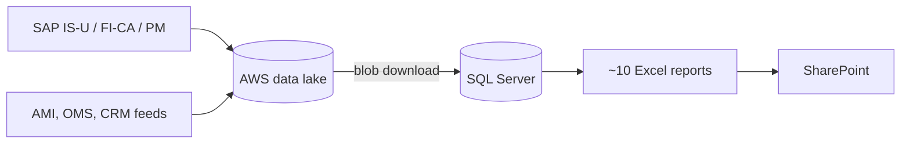

# Architecture

## Current state (as described by the employer)



Pain points typical of this setup (to confirm in conversation):

- Reports are refreshed by hand. Each workbook has its own copy of the logic, so numbers drift between reports.
- Workbooks hit row limits and slow down once detail data (AMI reads, bills) is included.
- There is no single definition of measures like "past due" or SAIDI. They get re-derived in pivot tables.
- Version history and lineage live in SharePoint file names.

## Demo implementation

> **Runs locally for free.** The lake is a Versity S3 Gateway container (S3 API on `localhost:7070`, bucket `utility-lake`), and the Glue/Athena role is played by DuckDB (`lake/build_curated.py`). The diagram below shows the AWS services each local piece stands in for. The same code targets real S3 by clearing `S3_ENDPOINT_URL` (see the README).

```mermaid
flowchart LR
    subgraph Sources [Source systems - generator/]
        ISU[SAP IS-U / FI-CA]
        PM[SAP PM]
        AMI[AMI head-end]
        OMS[OMS]
        CRM[Contact center]
        WX[Weather feed]
    end
    subgraph AWS [AWS data lake]
        RAW[(S3 raw zone<br/>csv.gz, Hive partitions)]
        CAT[Glue Data Catalog]
        ATH[Athena CTAS]
        CUR[(S3 curated zone<br/>Parquet)]
    end
    Sources --> RAW
    RAW --- CAT
    CAT --> ATH --> CUR
    CUR -- blob download<br/>aws/download.py --> STG[(SQL Server<br/>stg schema)]
    STG --> DW[(dw schema<br/>star model)]
    DW --> RPT[rpt views]
    RPT -- export --> GH[GitHub repo<br/>powerbi_data/]
    GH --> PBI[Power BI semantic model<br/>+ 10 report pages]
```



| Layer | Tool | Replaces / mirrors |
|---|---|---|
| Source extracts | `generator/generate.py` | SAP + operational systems dropping files into the lake |
| Raw zone | S3 `raw/` | Data lake landing area |
| Catalog / transform | Glue Data Catalog (always-free tier) + Athena CTAS | Lake processing. No Glue Spark jobs, so cost stays at cents. |
| Curated zone | S3 `curated/` Parquet | What downstream consumers pull |
| Blob download | `aws/download.py` (boto3) | The existing lake → SQL transfer |
| Database | SQL Server LocalDB (`UtilityDW`) | The employer's SQL database |
| Report storage | GitHub `powerbi_data/` | SharePoint |
| Reporting | Power BI Desktop | The ~10 Excel reports |

## Lake layout

```
s3://<bucket>/raw/<system>/<table>/[year_month=YYYY-MM/]part-0000.csv.gz
s3://<bucket>/curated/<table>/...parquet
s3://<bucket>/athena-results/
```

## Cost guardrails

- Set an AWS Budget alert at $5 before creating anything.
- Athena bills $5 per TB scanned. The whole Large raw zone is about 1 GB, so one full scan costs about half a cent.
- Glue Data Catalog stays inside the always-free tier (1M objects). No crawlers or Glue ETL jobs; tables are defined with DDL.
- S3 storage for a few GB costs pennies a month. Tear down with `aws/teardown` when finished.
